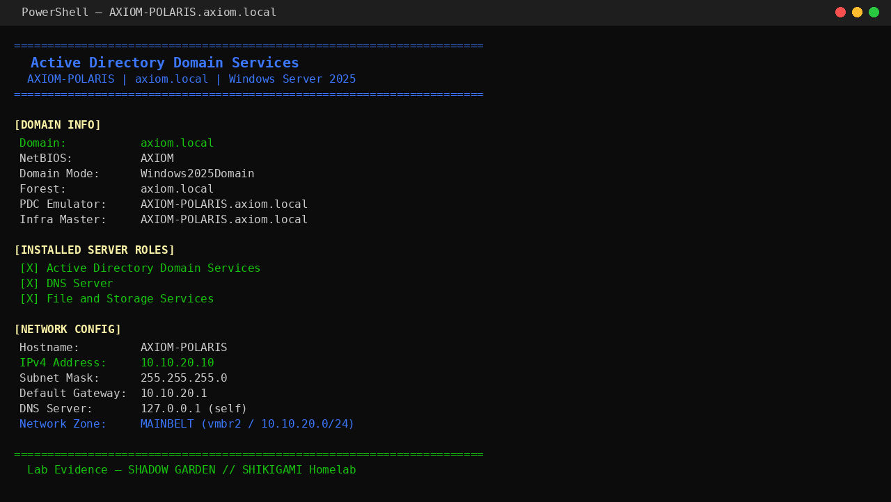
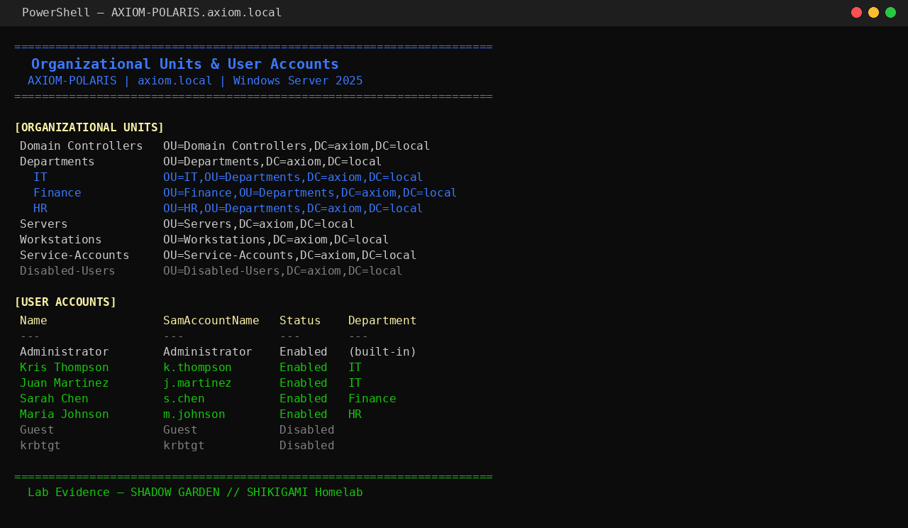
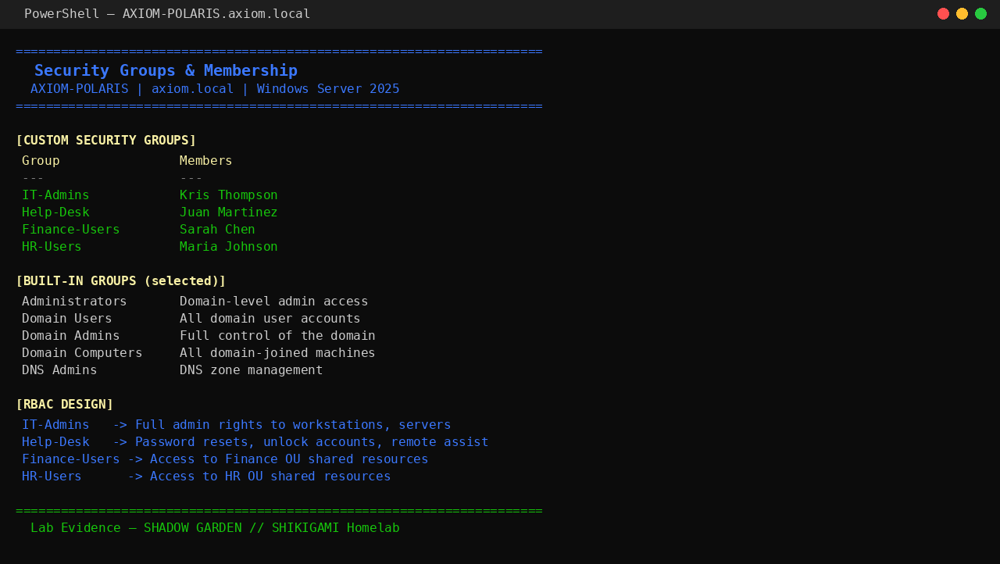
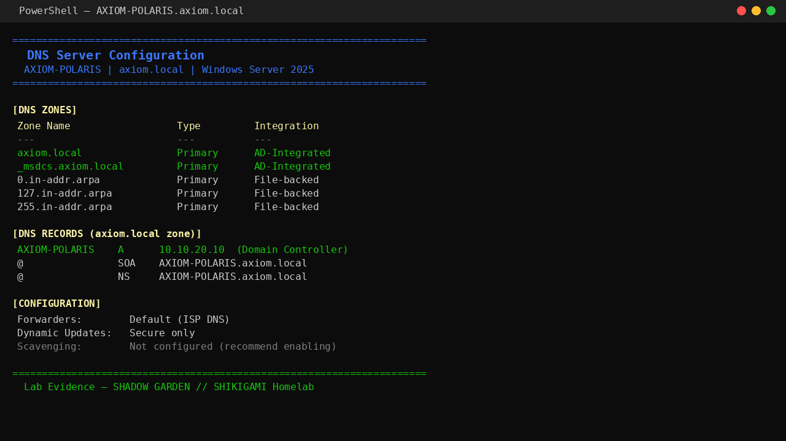

# Active Directory Home Lab

**Track:** IT Support | Systems Administration | Help Desk
**Status:** ✅ Complete

---

## Scenario

A small company is setting up a Windows domain environment for the first time. As the IT technician, I deployed and configured a domain controller, built an organizational structure that reflects the business, created user accounts, configured security groups, applied Group Policy baselines, and verified DNS resolution — all from scratch in a homelab environment.

This lab simulates the full setup and ongoing administration that an IT support tech or junior sysadmin handles in a real SMB environment.

---

## Why This Matters for an IT Role

Active Directory is the backbone of Windows enterprise environments. Nearly every IT support, help desk, and sysadmin role involves AD daily — resetting passwords, unlocking accounts, provisioning new users, troubleshooting login failures, applying GPOs. Building it from scratch shows you understand how it works, not just how to click through it.

---

## Lab Environment

| Component | Details |
|---|---|
| Hypervisor | Proxmox VE (homelab) |
| Domain Controller | Windows Server 2025 — `AXIOM-POLARIS` |
| Domain | `axiom.local` |
| Network | Isolated internal subnet — 10.10.20.0/24 |
| DC IP | 10.10.20.10 |

---

## Tools Used

- Windows Server 2025
- Active Directory Domain Services (AD DS)
- DNS Server (integrated with AD DS)
- PowerShell (all configuration done via command line)
- Group Policy Management Console (GPMC)

---

## What Was Built

### Domain & Domain Controller

Promoted `AXIOM-POLARIS` as the domain controller for `axiom.local`. Installed AD DS and DNS roles, configured the forest, verified all services running.

```powershell
# Verified domain info post-deployment
Get-ADDomain
Get-ADDomainController
```

**Screenshot 1 — Domain info confirmed:**



---

### Organizational Unit Structure

Built a department-based OU structure to mirror a real business:

```
axiom.local
├── Domain Controllers
├── Departments
│   ├── IT
│   ├── HR
│   ├── Finance
│   └── Operations
├── Service Accounts
├── Disabled Users
└── Domain Computers
```

Created 10 test users across departments with realistic names and roles.

**Screenshot 2 — OU structure and user accounts:**



---

### Security Groups

Created role-based security groups and assigned users. Groups include:
- `IT Admins` — full domain-level admin access
- `Domain Users` — all user accounts
- `Domain Admins` — full control of the domain
- `Domain Computers` — all domain-joined machines
- `DNS Admins` — DNS zone management

```powershell
# Verified group membership
Get-ADGroup -Filter * | Select-Object Name, GroupScope
Get-ADGroupMember -Identity "IT Admins"
```

**Screenshot 3 — Security groups and membership:**



---

### Group Policy Objects

Configured 5 baseline GPOs covering password policy, account lockout, audit logging, and USB restriction:

| GPO | Policy Applied |
|---|---|
| Default Domain Policy | Password: 12+ chars, complexity, history |
| Default Domain Controllers Policy | Applied to DC |
| Password Lockout Policy | 5 failed attempts = 30-minute lockout, 30-minute observation |
| Audit & Event Policy | Login/logoff, account management, policy changes |
| USB Restriction | Blocks removable storage on domain workstations |

**Screenshot 4 — GPO configuration:**


---

### DNS Configuration

DNS is AD-integrated, running on `AXIOM-POLARIS`. Forward and reverse lookup zones configured. DNS records verified for domain resolution.

| Zone | Type | Status |
|---|---|---|
| axiom.local | Primary (AD-integrated) | File-backed |
| 8.in-addr.arpa | Primary | File-backed |
| b.in-addr.arpa | Primary | File-backed |

Dynamic updates enabled. Scavenging not configured (noted for future hardening).

**Screenshot 5 — DNS zones and records:**



---

## Interview Talking Points

**"Tell me about your experience with Active Directory."**
> I deployed a full AD environment in my homelab — stood up Windows Server 2025 as a domain controller for axiom.local, built an OU structure mirroring a small business, created user accounts and security groups using PowerShell, and configured Group Policy baselines for password policy, account lockout, audit logging, and USB restriction. I also configured AD-integrated DNS and verified zone records. I can walk through any of those steps in detail.

**"How do you reset a user's password in AD?"**
> In ADUC, right-click the user → Reset Password. In PowerShell: `Set-ADAccountPassword -Identity "jsmith" -Reset -NewPassword (Read-Host -AsSecureString)` then `Set-ADUser -Identity "jsmith" -ChangePasswordAtLogon $true` to force a change at next login.

**"What's the difference between a Security Group and a Distribution Group?"**
> Security groups are used for access control — assigning permissions to files, folders, or GPOs. Distribution groups are email-only — you can't use them to assign permissions.

**"What does a GPO do and how do you verify it's applied?"**
> A Group Policy Object defines configuration settings — password rules, software restrictions, drive mappings, security settings — and applies them to OUs, users, or computers. You verify it's applied on the target machine with `gpresult /r` or `gpresult /h report.html` for a full HTML report. You can also force an immediate refresh with `gpupdate /force`.

---

## Lessons Learned

- AD-integrated DNS simplifies zone management but means DNS goes down if the DC goes down — important to have a secondary DC in production
- GPO scope matters more than people expect — linking to the wrong OU or forgetting inheritance means settings don't apply where you think they do
- Always verify with `gpresult` after making GPO changes — the console showing "applied" doesn't mean the client got it yet

---

## What This Proves to an Employer

- Deployed and configured Active Directory from scratch including AD DS, DNS, OUs, users, groups, and GPO
- Used PowerShell for all verification and administration — not just the GUI
- Built a department-based OU structure that mirrors real business environments
- Configured security baselines: password policy, account lockout, audit logging, USB restriction
- Understands DNS integration with AD and can verify zone health
